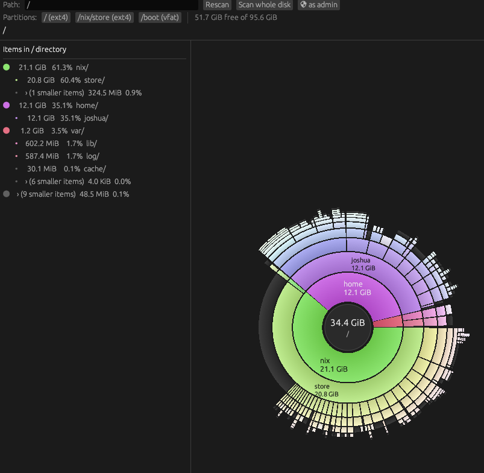

# disksun

disksun is an interactive disk-usage viewer for Linux. Each directory is drawn as a pie: every child is a wedge sized in proportion to its share of the parent, so a glance shows you where your space actually went. Written in Rust with [`eframe` / `egui`](https://github.com/emilk/egui), it runs on both Wayland and X11.

Click a wedge to descend into it; `h`, `Backspace`, or the "Up" button to go back; `q` quits. Drag a wedge onto the bin in the bottom-right to **permanently delete** that file or folder — a confirmation dialog fires first, but there is no undo and nothing goes to the Trash. The sidebar lists the largest children numerically (long names wrap within its fixed width), and the top bar lets you rescan an arbitrary path, jump to any mounted partition, or scan the whole disk as admin (via sudo in a terminal).



## Install

```sh
curl -fsSL https://raw.githubusercontent.com/zoraster-org/disksun/main/packaging/get-disksun.sh | sh
```

Or grab a `.deb` / `.rpm` / tarball from the [latest release](https://github.com/zoraster-org/disksun/releases/latest):

```sh
sudo apt install ./disksun_*_amd64.deb    # Debian / Ubuntu
sudo dnf install ./disksun-*.x86_64.rpm   # Fedora / RHEL
```

From source: `cargo install --git https://github.com/zoraster-org/disksun` (needs Rust + `libwayland-dev libxkbcommon-dev libgl-dev libx11-dev` or your distro's equivalent).

## Usage

```sh
disksun                    # scan $HOME
disksun /some/path         # scan a path
disksun --scan [--cross] / # headless, prints tree to stdout
```

## Nix / NixOS

Consume the repo as a non-flake input and build with `buildRustPackage` —
the committed `Cargo.lock` means no hash juggling, and `nix flake update`
tracks new commits:

```nix
# flake.nix
inputs.disksun-src = {
  url = "github:zoraster-org/disksun";
  flake = false;
};
```

```nix
disksun = pkgs.rustPlatform.buildRustPackage {
  pname = "disksun";
  version = "0.1.0";
  src = disksun-src;
  cargoLock.lockFile = "${disksun-src}/Cargo.lock";
  nativeBuildInputs = [ pkgs.makeWrapper ];
  # winit/glow dlopen wayland/xkbcommon/GL at runtime; on non-NixOS hosts
  # (e.g. Fedora + standalone home-manager) the Nix glibc doesn't consult
  # the distro's ld cache, so give the loader an explicit path:
  postFixup = ''
    wrapProgram $out/bin/disksun --prefix LD_LIBRARY_PATH : ${lib.makeLibraryPath [
      pkgs.wayland pkgs.libxkbcommon pkgs.libglvnd
    ]}
  '';
};
```

## License

GPL-3.0-or-later — see [LICENSE](LICENSE).
